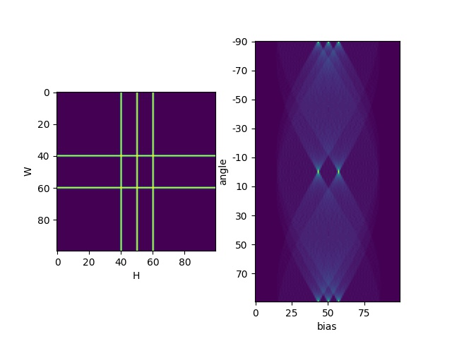

# Deep Hough Transform

### Build and Compile
Please verify your environment by running `python3 -m torch.utils.collect_env` and make sure you have proper environment.
We suggest `torch>=1.4.0` and `gcc>=7.3.0`. Please note that the gcc should be compatitable with torch else it will raise an error.

If you still cannot build the package, please file an issue with detailed environments.

<p style='color: red;'>We ONLY support Linux OS with CUDA installed !</p>


### Example
See [example.py](./example.py) for details.
```
import torch
from deephough import DeepHough
dh = DeepHough(num_angle=180, num_bias=100)
x = torch.zeros(100, 100).cuda()
x[40, :] = 1
x[60, :] = 1
x[:, [40, 50, 60]] = 1
y = dh(x.view(1, 1, 100, 100))
```


### Pre-built wheels

| Python  | CUDA | Torch | Wheel |
| ------------- | -------- | -------- | -------- |
| 3.8  | 11.0  | 1.9.0 | <https://data.kaizhao.net/projects/deep-hough-transform/wheels/deephough-0.1.0-cu110-cp38-linux_x86_64.whl> |
| 3.6  | 11.0  | 1.9.0 | <https://data.kaizhao.net/projects/deep-hough-transform/wheels/deephough-0.1.0-cu110-cp36-linux_x86_64.whl> |
